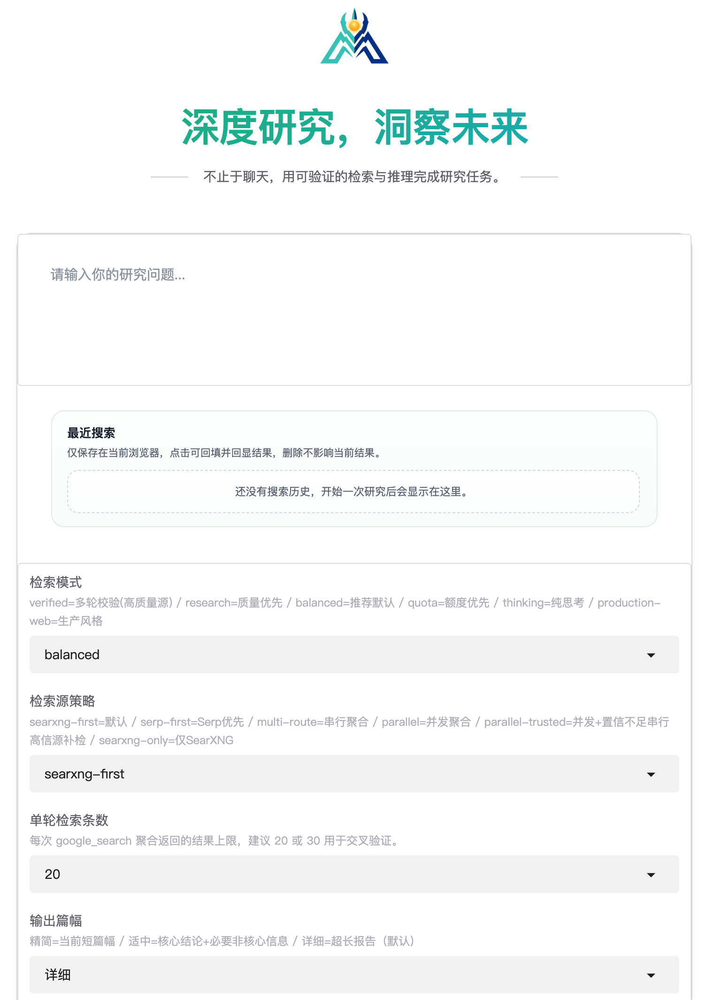

# OpenClaw-MiroSearch

<p align="center">
  
</p>

OpenClaw-MiroSearch 是一个面向智能体场景的开源联网检索工程，目标是提供可控成本、可配置路由与可编程调用接口。

> 📄 English version: [README.md](./README.md)

## 项目目标

- 降低检索成本：支持本地 SearXNG 与可选商业搜索源
- 提升结果稳定性：支持并发检索、置信度评估与高信源补检
- 便于系统集成：提供统一 API，便于 OpenClaw 与其他智能体接入

## 上游归属与许可证

本项目基于 [MiroMindAI/MiroThinker](https://github.com/MiroMindAI/MiroThinker) 改造。仓库在保留原有许可证要求的前提下，新增了面向 OpenClaw/Agent 工具链的工程化改造。兼容现有检索渠道（SearXNG、SerpAPI、Serper）与原有 MiroFlow 工具链。

- 许可证：[`LICENSE`](LICENSE)

## 已实现功能

- **6 种研究模式**：`production-web` / `verified` / `research` / `balanced`（默认） / `quota` / `thinking`
- **6 种检索路由**：`searxng-first` / `serp-first` / `multi-route` / `parallel` / `parallel-trusted` / `searxng-only`
- **多源检索**：SearXNG、SerpAPI、Serper —— 支持并发聚合与置信度补检
- **双接口接入**：FastAPI 标准 REST 接口（推荐，`/v1/research`）+ Gradio 兼容接口（`run_research_once`）
- **运行态可观测**：阶段心跳（检索/推理/校验/总结）、陈旧任务自动收敛

> 完整 API 规格与参数说明请参见 [`docs/API_SPEC.md`](docs/API_SPEC.md)
>
> 架构概览与数据流图请参见 [`docs/ARCHITECTURE.md`](docs/ARCHITECTURE.md)

<p align="center"></p>

## 代码结构

- `apps/gradio-demo/`：Web 入口与 API 服务
- `apps/miroflow-agent/`：Agent 运行与配置
- `libs/miroflow-tools/`：MCP 工具与检索路由实现
- `assets/`：品牌与静态资源
- `skills/openclaw-mirosearch/`：面向 OpenClaw 的调用技能包

## 快速部署

### 1. 安装依赖

```bash
cd apps/gradio-demo
uv sync
```

### 2. 初始化配置

```bash
cp .env.example .env
```

`.env` 最小示例：

```bash
# OpenAI 兼容 LLM 网关
BASE_URL="https://api.longcat.chat/openai"
API_KEY="<your_longcat_key>"
DEFAULT_LLM_PROVIDER="openai" # openai / anthropic / qwen
DEFAULT_MODEL_NAME="gpt-4o-mini"
MODEL_TOOL_NAME="gpt-4o-mini"
MODEL_FAST_NAME="gpt-4o-mini"
MODEL_THINKING_NAME="gpt-4o-mini"
MODEL_SUMMARY_NAME="gpt-4o-mini"

# 搜索源（至少配置一个）
SEARXNG_BASE_URL="http://127.0.0.1:27080"
SERPAPI_API_KEY="<your_serpapi_key>"
SERPER_API_KEY="<your_serper_key>"

# 默认运行策略
DEFAULT_RESEARCH_MODE="balanced"
DEFAULT_SEARCH_PROFILE="parallel-trusted"
```

模型配置说明：

- `DEFAULT_LLM_PROVIDER` 控制 provider 路由（`openai` / `anthropic` / `qwen`）。
- `DEFAULT_MODEL_NAME` 是默认主模型。
- 分角色模型：
  - `MODEL_TOOL_NAME`：工具调用阶段
  - `MODEL_FAST_NAME`：快速阶段
  - `MODEL_THINKING_NAME`：深度思考阶段
  - `MODEL_SUMMARY_NAME`：总结阶段
- 回退规则：
  - 未设置 `MODEL_TOOL_NAME` / `MODEL_FAST_NAME` / `MODEL_THINKING_NAME` 时，回退到 `DEFAULT_MODEL_NAME`
  - 未设置 `MODEL_SUMMARY_NAME` 时，回退到 `MODEL_FAST_NAME`

### 3. 启动服务

```bash
uv run main.py
```

默认地址：`http://127.0.0.1:8090`

### 4. 健康检查

```bash
curl -sS 'http://127.0.0.1:8090/health'
```

## API 调用示例

推荐使用 FastAPI API（异步任务队列）：

```bash
BASE_URL="http://127.0.0.1:8090"
QUERY="中国大陆有哪些厂商推出了 OpenClaw 变体？"
MODE="verified"
PROFILE="parallel-trusted"
RESULT_NUM=30
MIN_ROUNDS=4
DETAIL_LEVEL="balanced" # compact / balanced / detailed
CALLER_ID="openclaw-session-001"

TASK_ID=$(curl -sS -X POST "$BASE_URL/v1/research" \
  -H 'Content-Type: application/json' \
  -d "{\"query\":\"$QUERY\",\"mode\":\"$MODE\",\"search_profile\":\"$PROFILE\",\"search_result_num\":$RESULT_NUM,\"verification_min_search_rounds\":$MIN_ROUNDS,\"output_detail_level\":\"$DETAIL_LEVEL\",\"caller_id\":\"$CALLER_ID\"}" \
  | python3 -c 'import sys,json;print(json.load(sys.stdin)["task_id"])')

curl -sS "$BASE_URL/v1/research/$TASK_ID"
```

实时查看任务事件：

```bash
curl -sS -N "$BASE_URL/v1/research/$TASK_ID/stream"
```

按 `caller_id` 取消当前会话任务：

```bash
curl -sS -X POST "$BASE_URL/v1/research/cancel?caller_id=$CALLER_ID"
```

如需兼容旧链路或直接复用 Demo UI，仍可使用 Gradio API：

```bash
BASE_URL="http://127.0.0.1:8080"
curl -sS "$BASE_URL/gradio_api/info"
```

## 面向 OpenClaw / AI Agent

这个项目的定位：

- 提供可被上层智能体调用的联网研究能力
- 支持模式、路由、检索深度与输出篇幅四维可控
- 通过 SSE 终态事件，保证智能体编排时可判断任务完成

推荐给 AI Agent 的调用闭环：

1. 先调 `GET /health` 探活
1. 发起 `POST /v1/research`
1. 轮询 `GET /v1/research/{task_id}` 或订阅 `GET /v1/research/{task_id}/stream`
1. `status=completed` 或 `cached` 时，只消费最终 Markdown

Skill 使用建议（先分流）：

- 简单搜索（快速网页检索、单事实查询）：优先使用仓库内分发的 `searxng` skill
  - 仓库目录：`skills/searxng/`
  - 打包文件：`skills/searxng.zip`
- 深度检索或高质量检索（多来源交叉、核查、研究报告）：使用 `openclaw-mirosearch` skill

Skill 安装：

- 推荐双 skill 打包：`skills/openclaw-search-skills-bundle.zip`
- 简单搜索 skill：`skills/searxng/`
- 仓库目录：`skills/openclaw-mirosearch/`
- 打包文件：`skills/openclaw-mirosearch.zip`
- 安装说明：[`skills/openclaw-mirosearch/references/skill-install.md`](skills/openclaw-mirosearch/references/skill-install.md)

Skill 使用：

- 使用说明：[`skills/openclaw-mirosearch/references/usage.md`](skills/openclaw-mirosearch/references/usage.md)
- API 说明：[`skills/openclaw-mirosearch/references/api.md`](skills/openclaw-mirosearch/references/api.md)
- AI Agent 接入详解：[`docs/API_SPEC.md`](docs/API_SPEC.md)

## 建议配置基线

- **默认生产**：`mode=balanced` + `search_profile=parallel-trusted`
- **高风险事实核查**：`mode=verified` + `search_profile=parallel-trusted`
- **额度优先**：`mode=quota` + `search_profile=searxng-only`
- **核查深度**：`search_result_num=30` + `verification_min_search_rounds=4`

> 完整路由环境变量说明请参见 [`apps/miroflow-agent/README.md`](apps/miroflow-agent/README.md) 和 [`docs/API_SPEC.md`](docs/API_SPEC.md)

## 版本亮点

- `0.2.4` 版本亮点：
  - `scrape_url` 已支持 PDF 抽取，并带 20MB 流式响应体上限
  - 已支持 JSON / RSS / Atom / XML 结构化直通，返回 `json_keys`、`feed_title`、`entries`、`xml_root` 等字段
  - 重定向链路改为流式响应，并在中间 30x hop 及时关闭连接
  - 本地 Docker `app + api + worker + searxng + valkey` 真实端到端验证已通过
- `0.2.2` 版本亮点：
  - API 模式严重回归修复：`mode` / `search_profile` / `search_result_num` / `verification_min_search_rounds` / `output_detail_level` 已可端到端透传
  - Demo 断线重连：`BACKEND_MODE=api` 配合 `?task_id=xxx` 可通过 SSE 回放恢复任务
  - MCP `scrape_url` 初版上线：基于 `httpx + BeautifulSoup`，在 `google_search` 摘要不足时让 LLM 主动打开正文
  - 详细抓取路线图见 [`docs/SCRAPING_ITERATION_PLAN.md`](docs/SCRAPING_ITERATION_PLAN.md)

## 文档索引

- 文档总览：[`docs/README.md`](docs/README.md)
- 架构概览：[`docs/ARCHITECTURE.md`](docs/ARCHITECTURE.md)
- 部署指南：[`docs/DEPLOY.md`](docs/DEPLOY.md)
- API 规格 & Agent 接入：[`docs/API_SPEC.md`](docs/API_SPEC.md)
- 路线图：[`docs/ROADMAP.md`](docs/ROADMAP.md)
- 抓取能力迭代计划：[`docs/SCRAPING_ITERATION_PLAN.md`](docs/SCRAPING_ITERATION_PLAN.md)（T1-T9，对应 v0.2.4 → v0.3.0）
- 变更记录：[`docs/CHANGELOG.md`](docs/CHANGELOG.md)
- Demo 说明：[`apps/gradio-demo/README.md`](apps/gradio-demo/README.md)
- API Server 说明：[`apps/api-server/README.md`](apps/api-server/README.md)
- Agent 说明：[`apps/miroflow-agent/README.md`](apps/miroflow-agent/README.md)
- 工具层说明：[`libs/miroflow-tools/README.md`](libs/miroflow-tools/README.md)
- OpenClaw 技能包：[`skills/openclaw-mirosearch/SKILL.md`](skills/openclaw-mirosearch/SKILL.md)

## 开源协作文档

- 贡献、治理、支持与发布：[`docs/CONTRIBUTING.md`](docs/CONTRIBUTING.md)
- 安全策略：[`docs/SECURITY.md`](docs/SECURITY.md)
- 行为准则：[`docs/CODE_OF_CONDUCT.md`](docs/CODE_OF_CONDUCT.md)
- 变更记录：[`docs/CHANGELOG.md`](docs/CHANGELOG.md)

## 开发校验

```bash
# 仓库根目录
just format
just lint

# Demo 启动
cd apps/gradio-demo && uv sync && uv run main.py

# Agent 侧测试
cd apps/miroflow-agent && uv run pytest
```

## 路线图

路线图详见：[`docs/ROADMAP.md`](docs/ROADMAP.md)

当前规划分为以下阶段：

- `v0.2.0`（生产化）✅：异步任务队列（arq + Valkey）、SSE 流式输出、SearchProvider 协议化、持久化缓存、Docker Compose 多服务编排
- `v0.2.4` ✅：`scrape_url` 已具备重定向 SSRF 加固、共享 `httpx.AsyncClient`、PDF / JSON / RSS / Atom / XML 支持
- `v0.2.5`（当前）✅：详见 [`docs/SCRAPING_ITERATION_PLAN.md`](docs/SCRAPING_ITERATION_PLAN.md)，T6-T8 覆盖 `trafilatura`、HTML 表格转 markdown、智能截断，并补充 Prometheus 指标、Eval Pipeline CI 化、多源 RRF 融合排序、多语言检索优化
- `v0.3.0`（批量抓取 + 站点友好性）：详见 [`docs/SCRAPING_ITERATION_PLAN.md`](docs/SCRAPING_ITERATION_PLAN.md)，T9 覆盖批量 `scrape_urls`、配额限流与 `robots.txt` 校验
- `v1.0.0`（生态分发）：Helm Chart / 一键云部署、技能包版本化发布、兼容矩阵自动验证
