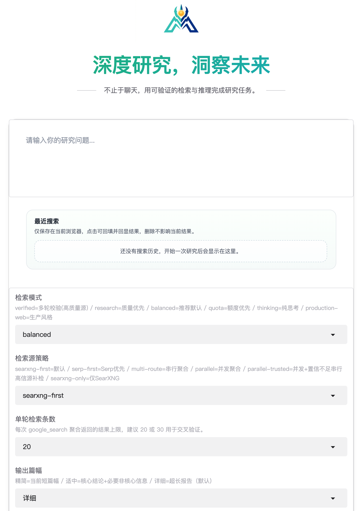

# 谛听（Diting）

<p align="center">
  
</p>

[English](README.md) | [中文](README_zh.md)

谛听（Diting）是基于 MiroThinker 构建的开源智能体研究服务，集成多源网页检索、正文抓取、多步推理、来源校验、异步执行和结构化 Markdown 报告。

当前稳定版本：**v0.2.11**。已发布变更见 [变更记录](docs/CHANGELOG_zh.md)，未来计划见 [路线图](docs/ROADMAP_zh.md)。

## 当前能力

- 6 种研究模式：`balanced`、`verified`、`research`、`production-web`、`quota` 和 `thinking`。
- 6 种检索策略：`searxng-first`、`serp-first`、`multi-route`、`parallel`、`parallel-trusted` 和 `searxng-only`。
- 搜索来源：SearXNG、SerpAPI、Serper、Tavily，以及可选的搜狗集成。
- 支持 HTML、纯文本、PDF、JSON、RSS、Atom 和 XML 正文抓取，并具备重定向 SSRF 校验、响应大小限制、编码恢复、表格保留和自然边界截断。
- 基于 arq 与 Valkey 的 FastAPI 任务服务，持久化任务元数据、事件流、结果、取消标记和结果缓存。
- Gradio 界面支持 API 后端重连、进度展示、可点击引用，以及 Markdown、PDF 和 Word 导出。
- 支持 OpenAI 兼容接口与 Anthropic，具备分阶段模型路由、多 Key 轮转、有界重试和模型故障回退。
- FastAPI 默认拒绝未配置鉴权的请求，并支持请求限流、调用方定向取消和任务级工具隔离。

批量 `scrape_urls`、Prometheus/Grafana、RRF 排序、MCP 适配层和 Helm Chart 等能力尚未实现，统一记录在 [路线图](docs/ROADMAP_zh.md) 中。

## 系统架构

默认 Docker Compose 包含 5 个服务：

| 服务 | 用途 | 默认宿主机端口 |
|---|---|---:|
| `app` | Gradio 界面与兼容 API | 8080 |
| `api` | FastAPI 研究接口 | 8090 |
| `worker` | arq 研究任务 Worker | — |
| `valkey` | 队列、任务状态、事件流和缓存 | 仅容器内部 |
| `searxng` | 自托管搜索服务 | 27080 |

数据流与模块边界见 [架构说明](docs/ARCHITECTURE_zh.md)。

## 快速开始

需要 Docker Compose v2、一个 OpenAI 兼容或 Anthropic LLM 端点，以及至少一个可用搜索来源。

<p align="center"></p>

```bash
cp .env.compose.example .env.compose
# 编辑 .env.compose，替换 LLM 和搜索服务的占位凭据。
docker compose --env-file .env.compose up -d --build
docker compose ps
```

示例配置默认只把端口绑定到 `127.0.0.1`，并通过 `AUTH_DISABLED=1` 显式启用本机无鉴权开发模式。用于共享或生产环境时，必须设置 `AUTH_DISABLED=0`、配置高强度 `API_TOKENS`，并为 Gradio API 后端设置相同的 `API_BEARER_TOKEN`，同时在服务前配置 TLS 终止。

检查服务：

```bash
curl -sS http://127.0.0.1:8090/health
curl -sS http://127.0.0.1:8080/gradio_api/info
curl -sS http://127.0.0.1:27080/healthz
```

源码安装、host-network 部署、鉴权和排错见 [部署指南](docs/DEPLOY_zh.md)。

## FastAPI 调用示例

提交任务：

```bash
curl -sS -X POST http://127.0.0.1:8090/v1/research \
  -H 'Content-Type: application/json' \
  -d '{
    "query": "对比量子计算最新的实用化进展",
    "mode": "verified",
    "search_profile": "parallel-trusted",
    "search_result_num": 30,
    "verification_min_search_rounds": 4,
    "output_detail_level": "balanced",
    "caller_id": "example-client"
  }'
```

响应包含 `task_id` 和 `status`。随后轮询或订阅任务：

```bash
curl -sS http://127.0.0.1:8090/v1/research/<task_id>
curl -sS -N http://127.0.0.1:8090/v1/research/<task_id>/stream
```

开启鉴权后，受保护请求需要增加 `Authorization: Bearer <token>`。完整契约见 [API 规格](docs/API_SPEC_zh.md)。

## 推荐组合

| 目标 | 模式 | 检索策略 | 建议深度 |
|---|---|---|---|
| 常规研究 | `balanced` | `parallel-trusted` | 20 条结果 |
| 事实核查 | `verified` | `parallel-trusted` | 30 条结果、4 轮检索 |
| 成本优先 | `quota` | `searxng-only` | 10-20 条结果 |
| 中国大陆且无稳定代理 | `balanced` | `searxng-first` | 20 条结果 |

这些是客户端推荐值，不是不可变的服务端默认值。省略可选字段时，服务端会使用部署环境中的 `DEFAULT_*` 配置解析有效参数。

## 文档

- [文档索引](docs/README_zh.md)
- [API 规格](docs/API_SPEC_zh.md)
- [架构说明](docs/ARCHITECTURE_zh.md)
- [部署指南](docs/DEPLOY_zh.md)
- [路线图](docs/ROADMAP_zh.md)
- [变更记录](docs/CHANGELOG_zh.md)
- [安全策略](docs/SECURITY_zh.md)
- [贡献指南](docs/CONTRIBUTING_zh.md)
- [Diting Skill](skills/diting/SKILL.md)

## 开发

主要应用和工具库要求 Python 3.12+。

```bash
# 安装依赖
cd apps/gradio-demo && uv sync
cd ../miroflow-agent && uv sync
cd ../../libs/miroflow-tools && uv sync
```

如需兼容旧链路或直接复用 Demo UI，仍可使用 Gradio API：

```bash
BASE_URL="http://127.0.0.1:8080"
curl -sS "$BASE_URL/gradio_api/info"
```

## 面向 OpenClaw / AI Agent

这个项目的定位：

- 提供可被上层智能体调用的联网研究能力
- 支持模式、路由、检索深度与输出篇幅四维可控
- 通过 SSE 终态事件，保证智能体编排时可判断任务完成

推荐给 AI Agent 的调用闭环：

1. 先调 `GET /health` 探活
1. 发起 `POST /v1/research`
1. 轮询 `GET /v1/research/{task_id}` 或订阅 `GET /v1/research/{task_id}/stream`
1. `status=completed` 或 `cached` 时，只消费最终 Markdown

Skill 使用建议（先分流）：

- 简单搜索（快速网页检索、单事实查询）：优先使用仓库内分发的 `searxng` skill
  - 仓库目录：`skills/searxng/`
  - 打包文件：`skills/searxng.zip`
- 深度检索或高质量检索（多来源交叉、核查、研究报告）：使用 `diting` skill

Skill 安装：

- 推荐双 skill 打包：`skills/openclaw-search-skills-bundle.zip`
- 简单搜索 skill：`skills/searxng/`
- 仓库目录：`skills/diting/`
- 打包文件：`skills/diting.zip`
- 安装说明：[`skills/diting/references/skill-install.md`](skills/diting/references/skill-install.md)

Skill 使用：

- 使用说明：[`skills/diting/references/usage.md`](skills/diting/references/usage.md)
- API 说明：[`skills/diting/references/api.md`](skills/diting/references/api.md)
- AI Agent 接入详解：[`docs/API_SPEC.md`](docs/API_SPEC.md)

## 建议配置基线

- **默认生产**：`mode=balanced` + `search_profile=parallel-trusted`
- **高风险事实核查**：`mode=verified` + `search_profile=parallel-trusted`
- **额度优先**：`mode=quota` + `search_profile=searxng-only`
- **核查深度**：`search_result_num=30` + `verification_min_search_rounds=4`

> 完整路由环境变量说明请参见 [`apps/miroflow-agent/README.md`](apps/miroflow-agent/README.md) 和 [`docs/API_SPEC.md`](docs/API_SPEC.md)

## 版本亮点

- `0.2.4` 版本亮点：
  - `scrape_url` 已支持 PDF 抽取，并带 20MB 流式响应体上限
  - 已支持 JSON / RSS / Atom / XML 结构化直通，返回 `json_keys`、`feed_title`、`entries`、`xml_root` 等字段
  - 重定向链路改为流式响应，并在中间 30x hop 及时关闭连接
  - 本地 Docker `app + api + worker + searxng + valkey` 真实端到端验证已通过
- `0.2.2` 版本亮点：
  - API 模式严重回归修复：`mode` / `search_profile` / `search_result_num` / `verification_min_search_rounds` / `output_detail_level` 已可端到端透传
  - Demo 断线重连：`BACKEND_MODE=api` 配合 `?task_id=xxx` 可通过 SSE 回放恢复任务
  - MCP `scrape_url` 初版上线：基于 `httpx + BeautifulSoup`，在 `google_search` 摘要不足时让 LLM 主动打开正文
  - 详细抓取路线图见 [`docs/SCRAPING_ITERATION_PLAN.md`](docs/SCRAPING_ITERATION_PLAN.md)

## 文档索引

- 文档总览：[`docs/README.md`](docs/README.md)
- 架构概览：[`docs/ARCHITECTURE.md`](docs/ARCHITECTURE.md)
- 部署指南：[`docs/DEPLOY.md`](docs/DEPLOY.md)
- API 规格 & Agent 接入：[`docs/API_SPEC.md`](docs/API_SPEC.md)
- 路线图：[`docs/ROADMAP.md`](docs/ROADMAP.md)
- 抓取能力迭代计划：[`docs/SCRAPING_ITERATION_PLAN.md`](docs/SCRAPING_ITERATION_PLAN.md)（T1-T9，对应 v0.2.4 → v0.3.0）
- 变更记录：[`docs/CHANGELOG.md`](docs/CHANGELOG.md)
- Demo 说明：[`apps/gradio-demo/README.md`](apps/gradio-demo/README.md)
- API Server 说明：[`apps/api-server/README.md`](apps/api-server/README.md)
- Agent 说明：[`apps/miroflow-agent/README.md`](apps/miroflow-agent/README.md)
- 工具层说明：[`libs/miroflow-tools/README.md`](libs/miroflow-tools/README.md)
- Diting 技能包：[`skills/diting/SKILL.md`](skills/diting/SKILL.md)

## 开源协作文档

- 贡献、治理、支持与发布：[`docs/CONTRIBUTING.md`](docs/CONTRIBUTING.md)
- 安全策略：[`docs/SECURITY.md`](docs/SECURITY.md)
- 行为准则：[`docs/CODE_OF_CONDUCT.md`](docs/CODE_OF_CONDUCT.md)
- 变更记录：[`docs/CHANGELOG.md`](docs/CHANGELOG.md)

## 开发验证

```bash
# 仓库级检查
just lint
just sort-imports
just format
just format-md

# 分模块测试
cd apps/miroflow-agent && uv sync && uv run pytest
cd apps/api-server && uv sync && AUTH_DISABLED=1 uv run pytest
cd apps/gradio-demo && uv sync && uv run pytest
cd libs/miroflow-tools && uv sync && uv run pytest
```

## 许可证与上游

本仓库基于 [MiroMindAI/MiroThinker](https://github.com/MiroMindAI/MiroThinker) 改造，并保留其许可证要求。详见 [LICENSE](LICENSE) 及项目历史中的上游归属说明。
