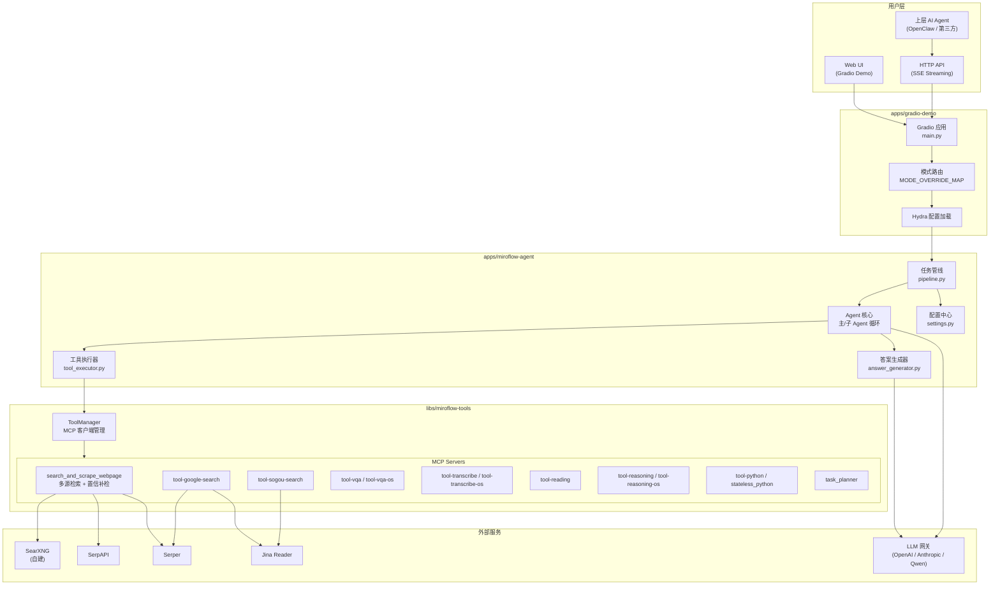
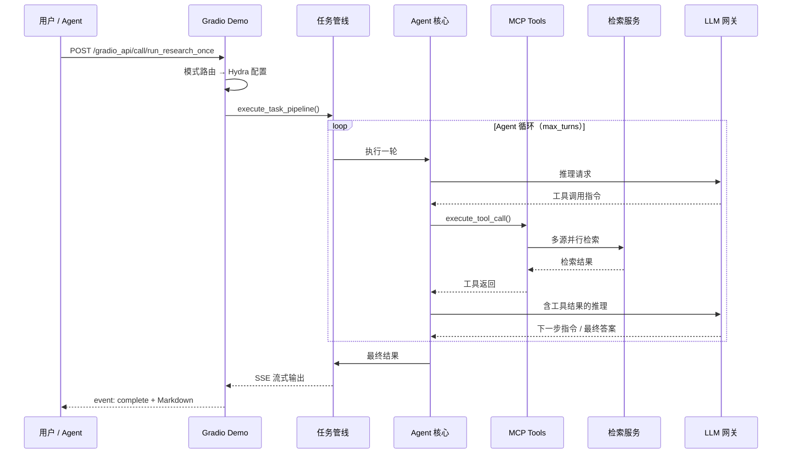
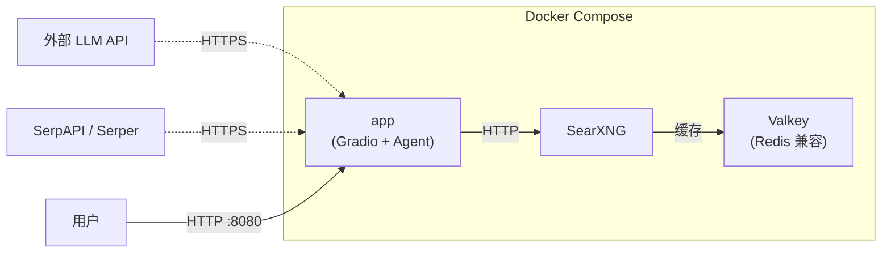

# 架构概览

> 📄 English version: [ARCHITECTURE_en.md](./ARCHITECTURE_en.md)

本文档描述 OpenClaw-MiroSearch 的整体架构与模块职责。

## 系统架构图

## 模块职责

### `apps/gradio-demo` — Web UI 与 API 入口

- Gradio 构建的 Web 界面，同时暴露 SSE 流式 API
- 负责模式路由：将 `mode`（balanced / verified / research 等）映射为 Hydra 配置覆盖
- 管理搜索历史（浏览器 localStorage）、技能包下载、运行时观测（阶段心跳）
- 陈旧任务巡检线程：自动将长时间未更新的 `running` 任务收敛为 `failed`

### `apps/miroflow-agent` — Agent 核心

- Hydra 配置体系：`conf/agent/*.yaml` 定义 Agent 行为（工具集、最大轮次、黑名单等）
- 主 Agent 循环：接收查询 → 工具调用 → LLM 推理 → 答案生成
- 子 Agent 支持（如 browsing agent），通过 `expose_sub_agents_as_tools` 暴露为工具
- 配置中心 `settings.py`：集中加载所有环境变量与 MCP Server 参数

### `libs/miroflow-tools` — 共享工具框架

- `ToolManager`：MCP 客户端生命周期管理，支持并发工具调用
- MCP Servers：每个工具以独立 stdio 进程运行，通过 MCP 协议通信
- 核心检索工具 `search_and_scrape_webpage`：多源并行检索、置信度评估、高信源补检

### 外部服务依赖

| 服务 | 用途 | 必选 |
|------|------|------|
| SearXNG | 自建搜索聚合 | 推荐（免费） |
| SerpAPI / Serper | 商业搜索 API | 至少配一个搜索源 |
| LLM 网关 | 推理与生成 | 必选 |
| Jina Reader | 网页抓取与解析 | 推荐 |

## 数据流

## 部署拓扑

