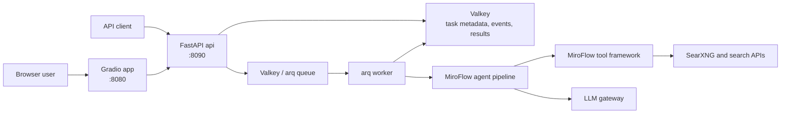
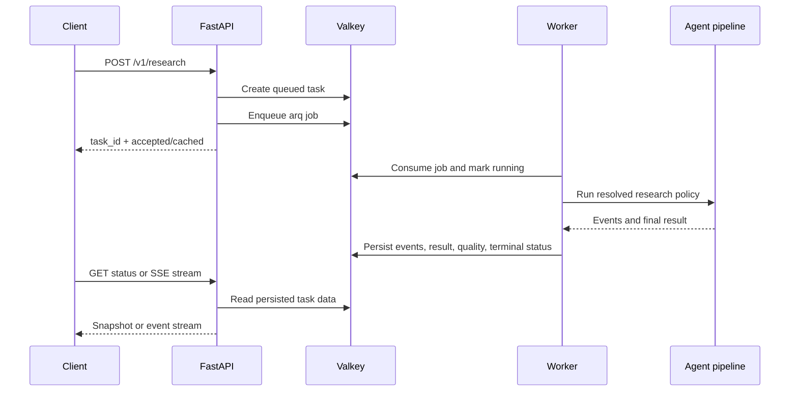

# Architecture

[中文](./ARCHITECTURE_zh.md)

This document describes the runtime architecture in project release `v0.2.11`.
It covers implemented components only.

## Runtime overview

```mermaid
flowchart LR
    Client["API client"] --> API["FastAPI api<br/>:8090"]
    User["Browser user"] --> App["Gradio app<br/>:8080"]
    App --> API
    API --> Store["Valkey<br/>task metadata, events, results"]
    API --> Queue["Valkey / arq queue"]
    Queue --> Worker["arq worker"]
    Worker --> Pipeline["MiroFlow agent pipeline"]
    Pipeline --> Tools["MiroFlow tool framework"]
    Tools --> Search["SearXNG and search APIs"]
    Pipeline --> LLM["LLM gateway"]
    Worker --> Store
```

FastAPI is the primary service integration surface. The Gradio app provides the
web UI and compatibility endpoints; in the default Compose topology it submits
research tasks to FastAPI with `BACKEND_MODE=api`.

## Compose services

| Service | Responsibility | Exposed port |
| --- | --- | --- |
| `app` | Gradio UI and compatibility API | `127.0.0.1:8080` |
| `api` | FastAPI task API, status polling, SSE, cancellation, metrics | `127.0.0.1:8090` |
| `worker` | arq worker that executes the research pipeline | None |
| `valkey` | Task queue, metadata, events, results, cache, SearXNG Redis backend | None |
| `searxng` | Self-hosted metasearch service | `127.0.0.1:27080` |

The host and ports are configurable. See [Deployment Guide](./DEPLOY.md).

## Component responsibilities

### `apps/api-server`

- validates the public research request contract;
- applies authentication and request rate limiting;
- resolves effective mode, search profile, depth, verification rounds, and
  output detail;
- creates persistent task records and enqueues arq jobs;
- exposes polling, SSE replay, scoped cancellation, metrics, and health.

### `apps/api-server/worker.py`

- consumes jobs from the arq queue;
- runs one task with its resolved policy parameters;
- persists events, final output, quality metadata, and terminal status;
- observes task cancellation and bounded retry/timeout settings.

### `apps/gradio-demo`

- provides the browser UI and history/reconnect behavior;
- exposes legacy Gradio call endpoints;
- delegates tasks to FastAPI in the default Compose configuration;
- can run the pipeline locally when explicitly configured for local backend
  mode.

### `apps/miroflow-agent`

- loads Hydra agent and model configuration;
- coordinates the main-agent and sub-agent loops;
- executes tools and builds the final research answer;
- maps pipeline output into a stable result and quality contract.

### `libs/miroflow-tools`

- manages the lifecycle of the project's MCP-based subprocess tools;
- provides search, scraping, reading, reasoning, Python, media, and planning
  tools;
- routes searches across SearXNG and configured commercial providers.

These internal MCP clients and subprocess tools are implementation details.
The repository does not currently ship a public, general-purpose MCP server for
external clients. A standard MCP adapter remains roadmap work.

## Task lifecycle

```mermaid
sequenceDiagram
    participant C as Client
    participant A as FastAPI
    participant V as Valkey
    participant W as Worker
    participant P as Agent pipeline

    C->>A: POST /v1/research
    A->>V: Create queued task
    A->>V: Enqueue arq job
    A-->>C: task_id + accepted/cached
    W->>V: Consume job and mark running
    W->>P: Run resolved research policy
    P-->>W: Events and final result
    W->>V: Persist events, result, quality, terminal status
    C->>A: GET status or SSE stream
    A->>V: Read persisted task data
    A-->>C: Snapshot or event stream
```

The persisted states are `queued`, `running`, `completed`, `failed`,
`cancelled`, and `cached`. A cache hit still receives its own task ID and
persisted result, so clients use the same polling or streaming flow.

## Data and storage boundaries

Valkey separates queue and task-store databases through configuration. It
stores task metadata, event streams, final Markdown, result-quality metadata,
caller-to-task indexes, the latest metrics record, and the shared result cache.
TTL, queue name, stream length, and worker concurrency are environment-driven.

SearXNG uses the same Valkey service as a Redis-compatible backend but remains a
separate search component. External LLM and search provider credentials stay in
environment configuration and are not stored in repository files.

## Security boundaries

- FastAPI protected endpoints are fail-closed unless `AUTH_DISABLED=1` is
  explicitly selected for local development.
- `/health` is public; `/v1/*` endpoints are protected.
- Cancellation is limited to a task ID or a required `caller_id`; there is no
  global-cancel fallback.
- Compose publishes service ports on `127.0.0.1` by default.
- Scraping tools enforce URL and response constraints inside the tool layer.

See [Security Policy](./SECURITY.md) and
[API Specification](./API_SPEC.md) for operational details.
