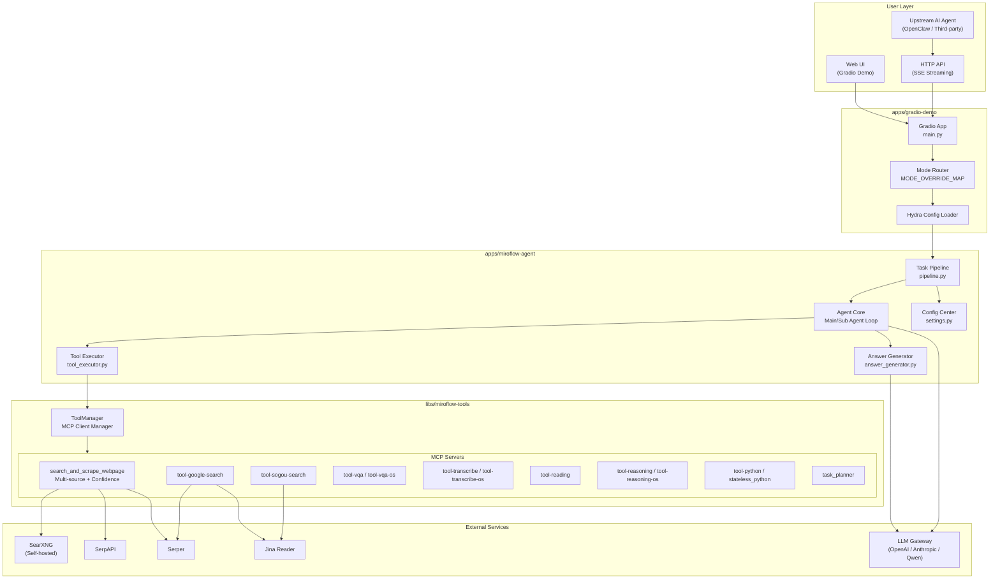
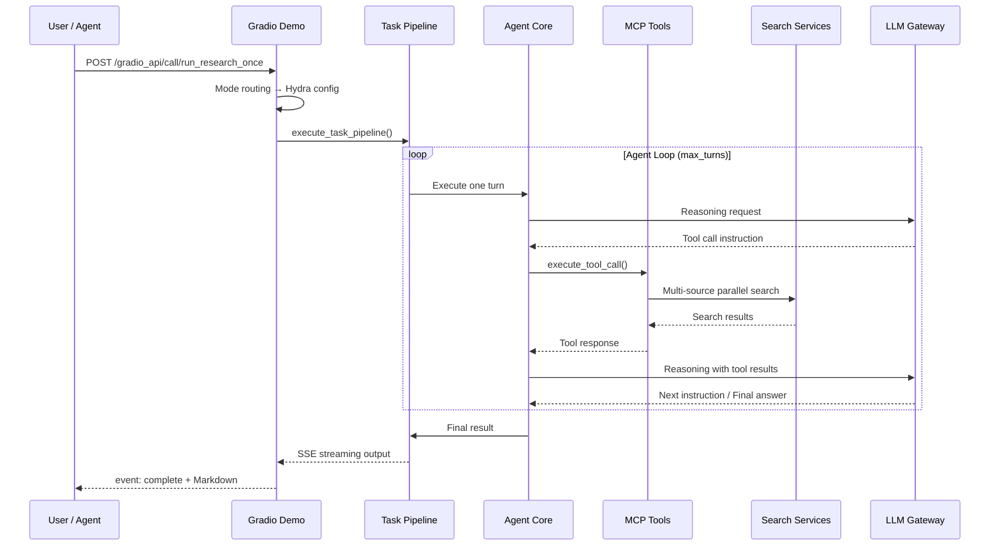
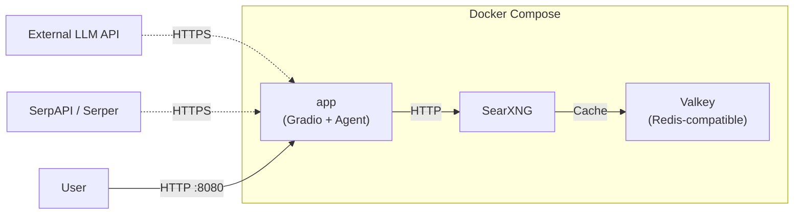

# Architecture Overview

> 📄 中文版：[ARCHITECTURE.md](./ARCHITECTURE.md)

This document describes the overall architecture and module responsibilities of OpenClaw-MiroSearch.

## System Architecture

## Module Responsibilities

### `apps/gradio-demo` — Web UI & API Entry

- Gradio-based Web UI that also exposes SSE streaming API
- Mode routing: maps `mode` (balanced / verified / research, etc.) to Hydra config overrides
- Manages search history (browser localStorage), skill package downloads, runtime observability (stage heartbeat)
- Stale task reconciliation thread: auto-converges long-stale `running` tasks to `failed`

### `apps/miroflow-agent` — Agent Core

- Hydra config system: `conf/agent/*.yaml` defines agent behavior (tool sets, max turns, blacklists, etc.)
- Main agent loop: receive query → tool calls → LLM reasoning → answer generation
- Sub-agent support (e.g., browsing agent), exposed as tools via `expose_sub_agents_as_tools`
- Config center `settings.py`: centralized loading of all environment variables and MCP Server parameters

### `libs/miroflow-tools` — Shared Tool Framework

- `ToolManager`: MCP client lifecycle management with concurrent tool call support
- MCP Servers: each tool runs as an independent stdio process, communicating via MCP protocol
- Core retrieval tool `search_and_scrape_webpage`: multi-source parallel search, confidence evaluation, high-trust supplemental retrieval

### External Service Dependencies

| Service | Purpose | Required |
|---------|---------|----------|
| SearXNG | Self-hosted search aggregation | Recommended (free) |
| SerpAPI / Serper | Commercial search API | At least one search source |
| LLM Gateway | Reasoning & generation | Required |
| Jina Reader | Web scraping & parsing | Recommended |

## Data Flow

## Deployment Topology

