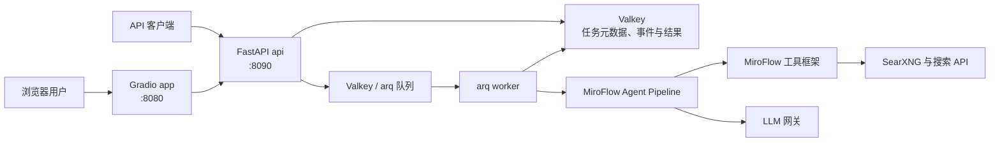
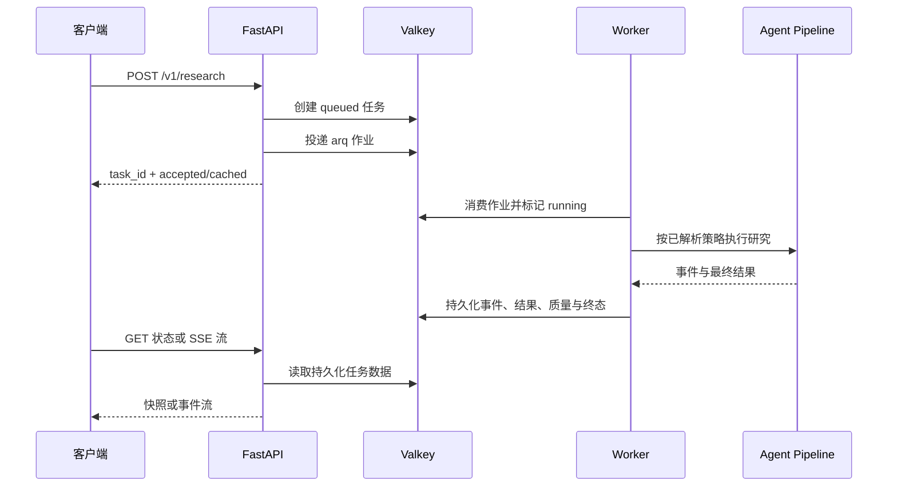

# 架构

[English](./ARCHITECTURE.md)

本文档描述项目发布版本 `v0.2.11` 的运行时架构，只包含已经实现的组件。

## 运行时概览

FastAPI 是主要的服务集成接口。Gradio 应用提供 Web UI 和兼容端点；在默认
Compose 拓扑中，它通过 `BACKEND_MODE=api` 向 FastAPI 提交研究任务。

## Compose 服务

| 服务 | 职责 | 对外端口 |
| --- | --- | --- |
| `app` | Gradio UI 与兼容 API | `127.0.0.1:8080` |
| `api` | FastAPI 任务 API、状态轮询、SSE、取消与指标 | `127.0.0.1:8090` |
| `worker` | 执行研究 Pipeline 的 arq Worker | 无 |
| `valkey` | 任务队列、元数据、事件、结果、缓存与 SearXNG Redis 后端 | 无 |
| `searxng` | 自建元搜索服务 | `127.0.0.1:27080` |

主机地址和端口均可配置，参见[部署指南](./DEPLOY_zh.md)。

## 组件职责

### `apps/api-server`

- 校验公开研究请求契约；
- 执行鉴权和请求限流；
- 解析实际生效的模式、检索路由、深度、校验轮次和输出篇幅；
- 创建持久化任务记录并投递 arq 作业；
- 提供轮询、SSE 回放、定向取消、指标和健康检查。

### `apps/api-server/worker.py`

- 从 arq 队列消费作业；
- 使用已解析的策略参数执行单个任务；
- 持久化事件、最终输出、质量元数据和终态；
- 遵循任务取消以及有界重试、超时配置。

### `apps/gradio-demo`

- 提供浏览器 UI、历史记录和重连行为；
- 暴露旧版 Gradio 调用端点；
- 在默认 Compose 配置中将任务委托给 FastAPI；
- 显式配置为本地后端模式时，也可以在本进程运行 Pipeline。

### `apps/miroflow-agent`

- 加载 Hydra Agent 与模型配置；
- 协调主 Agent 和子 Agent 循环；
- 执行工具并生成最终研究答案；
- 将 Pipeline 输出映射为稳定的结果与质量契约。

### `libs/miroflow-tools`

- 管理项目内部基于 MCP 的子进程工具生命周期；
- 提供搜索、抓取、阅读、推理、Python、媒体和规划工具；
- 在 SearXNG 与已配置的商业检索源之间路由。

这些内部 MCP 客户端和子进程工具属于实现细节。仓库目前没有为外部客户端提供
通用、公开的 MCP Server；标准 MCP 适配层仍属于路线图任务。

## 任务生命周期

持久化状态包括 `queued`、`running`、`completed`、`failed`、`cancelled` 和
`cached`。缓存命中仍会获得独立任务 ID 和持久化结果，因此客户端继续使用相同的
轮询或流式流程。

## 数据与存储边界

Valkey 通过配置拆分队列数据库和任务存储数据库。它保存任务元数据、事件流、最终
Markdown、结果质量元数据、调用方任务索引、最近一次指标记录和共享结果缓存。
TTL、队列名称、事件流长度及 Worker 并发均由环境变量驱动。

SearXNG 使用同一个 Valkey 服务作为 Redis 兼容后端，但仍是独立的搜索组件。外部
LLM 与搜索提供商凭据保存在环境配置中，不写入仓库文件。

## 安全边界

- 除非本机开发显式选择 `AUTH_DISABLED=1`，FastAPI 受保护端点默认
  fail-closed；
- `/health` 公开，`/v1/*` 端点受保护；
- 取消操作只能基于任务 ID 或必填的 `caller_id`，不会退化为全局取消；
- Compose 默认只在 `127.0.0.1` 发布服务端口；
- 抓取工具在工具层执行 URL 与响应约束。

运维细节参见[安全政策](./SECURITY_zh.md)和
[API 规格说明](./API_SPEC_zh.md)。
