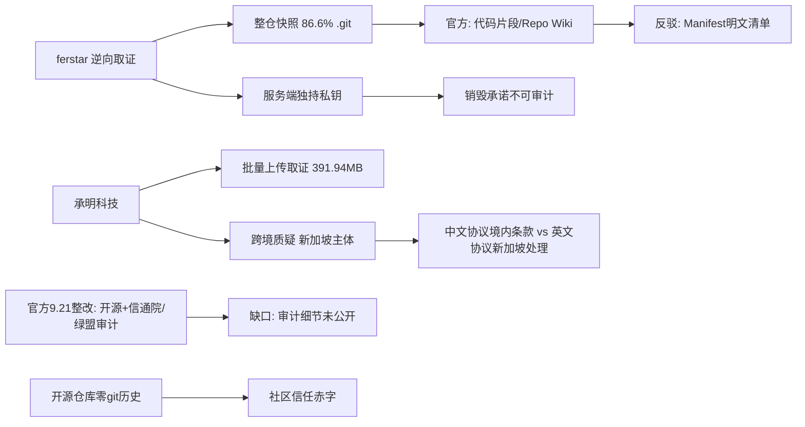

## 结论

\textbf{一句话核心结论}：ZCode在登录状态下静默将含完整.git历史（占载荷86.6\%）的整仓快照加密直传阿里云OSS已被多源实锤并促成72小时内开源整改，但"数据是否流向新加坡主体”的跨境质疑、“立即销毁不留存”的官方承诺均因直传OSS绕过审计、官方拒答而悬而未决——技术事实已明，责任与数据流向仍是罗生门。

<!-- confidence:high -->
**置信度：高**

## 要点

- 2026年9月18日，开发者ferstar逆向取证曝光智谱AI编程工具ZCode在用户登录状态下静默将**整个代码仓库（含完整.git历史，占载荷86.6%）**打包加密后直传阿里云OSS，端到端上传链路、快照构成均有多个独立信源交叉印证（**高置信度**）。
- 但“数据是否实际跨境至新加坡主体”目前仅有承明科技单方取证与协议文本矛盾作为依据，智谱未正面回应，数据实际出境无实证（**低置信度，未决**）。

## 争议与不确定

| 议题 | 官方/智谱 | ferstar | 承明科技/社区 | 口径原因推测 |
|---|---|---|---|---|
| 上传范围 | "代码片段/Repo Wiki索引数据" | 整仓快照，.git占86.6% | "结构完整归档"，含商业机密 | 官方淡化范围以降低违规定性风险 |
| 销毁承诺 | "页面生成后立即销毁，不会保存" | 直传OSS绕过应用服务器，无记录可查 | 9.18凌晨仍检测到上传 | 绕行架构使承诺客观上不可审计 |
| 修复时点 | 9.18称已修复 | — | 9.18凌晨仍见上传；3.14.0迟至9.19 | "修复"或指停止新触发而非截断存量队列 |
| 开关有效性 | 暗示可经设置管理 | 代码证明开关不控制上传 | — | 默认开启+开关失灵是追责核心 |
| **跨境** | 未正面回应；中文协议承诺境内存储不跨境（北京智谱华章） | — | 请求指向zcode.z.ai，对应新加坡主体JINGSHENG HENGXING（Z.AI隐私政策称数据通常在新加坡处理） | 境内/境外双协议架构与VIE子公司布局的固有矛盾 |
| 训练用途 | "从未用于模型训练、不留存" | "Optimize Experience"开关实为训练授权 | 要求说明第三方共享情况 | 单方宣称，无法核实 |
| 开源诚意 | 道歉三天后开源接受监督 | — | 开源仓库"零git历史”，与上传用户完整git历史形成讽刺对照 | 舆情修复动作 vs 社区信任赤字 |

## 证据与来源

### 时间线 / Timeline

- **8月28日—9月14日**：承明科技取证期内，超6个工作区被上传，最大391.94MB
- **9月18日凌晨**：ferstar发文曝光（256GB MacBook Air清理磁盘时发现~/.zcode占700MB+、313MB加密包、564次失败）；团队回复"hey I am sorry to let you find it"
- **9月18日下午**：智谱用户群致歉，称Repo Wiki触发、默认开启、已修复、承诺立即销毁、补偿周额度
- **9月19日**：ZCode 3.14.0发布（“修复仓库百科异常上传”）
- **9月19日晚**：承明科技公开致智谱函，提11项要求、跨境质疑、限10月10日书面答复
- **9月20日**：财中社/凤凰网/新浪以“涉嫌违规向境外传信息”报道；承明科技函件广泛传播
- **9月21日08:45**：ZCode公众号公告整改完成、开源GitHub、移除Repo Wiki、切断快照上传链路；信通院+绿盟审计；当日股价翻红
- **10月10日**：承明科技要求的书面答复截止日（未来时点）

### Evidence

1. 快照构成数字（313MB、42,411文件、86.6%、196.1MB/102.2MB/0.6MB/46.2MB、345MB工作区）：ferstar逆向分析，见知乎专栏《ZCode上传代码追踪：86.6%是Git历史，日志被删》（zhuanlan.zhihu.com/p/2085008412828610829）、《ZCode静默上传Git历史被扒，一次313MB直传阿里云》（p/2084629727038517696，2026-09-18/19）
2. 62次捕获/会话、删包半小时重打包（564→565）：知乎ferstar独立取证文（p/2084421520261227907）
3. 564次上传失败滞留本地：知乎“三天开源”文（p/2085473394431207370）及CSDN（2026-09-21）独立印证
4. 发现过程（700MB+目录、256GB MacBook Air）：网易《一份Repo Wiki，绊了下智谱》
5. 承明科技取证（391.94MB、超6工作区、32次失败、8.28–9.14、11项要求、10月10日限答）：新浪财经（2026-09-20）、搜狐（2026-09-20）
6. 跨境质疑（JINGSHENG HENGXING TECHNOLOGY PTE.LTD.、zcode.z.ai/cdn-zcode.z.ai、新加坡处理条款、中文协议境内存储条款）：财中社、凤凰网（2026-09-20）、BigGo财经、X@_FORAB
7. 官方回应与整改（9.21 08:45公告、移除Repo Wiki、信通院/绿盟、zcode-prod存储桶评测、开源）：东方财富（2026-09-21）、新浪财经（2026-09-21）、腾讯新闻（2026-09-20，含“立即销毁”表态）、知乎“零git历史”问题（2085304660995457603）
8. “日志被删”取证障碍：知乎追踪文标题及内容（单一来源倾向，但与“绕过应用服务器无记录”逻辑互洽）

### References

1. 知乎专栏《ZCode上传代码追踪：86.6%是Git历史，日志被删》，zhuanlan.zhihu.com/p/2085008412828610829
2. 知乎专栏《ZCode静默上传Git历史被扒，一次313MB直传阿里云》，p/2084629727038517696
3. 知乎专栏《ZCode被曝整仓静默上传，我做了独立取证，我也中招了！》，p/2084421520261227907
4. 知乎《“偷传代码”风波后，智谱把ZCode开源了：三天》，p/2085473394431207370
5. 知乎问题《如何看待ZCode道歉三天后开源：零git历史》，2085304660995457603（含9.21 08:45官方公告）
6. 财中社《智谱ZCode涉嫌违规向境外传信息》，m.caizhongshe.cn，2026-09-20
7. 新浪财经《智谱ZCode涉嫌违规向境外传信息》/承明科技发函，finance.sina.com.cn，2026-09-20
8. 凤凰网《智谱偷传数据风波扩大，有企业要求说明是否跨境传输》，news.ifeng.com/c/8wZVwrW7hfZ
9. 东方财富《智谱回应AI编程工具ZCode隐私争议》，2026-09-21（信通院/绿盟、zcode-prod存储桶）
10. 腾讯新闻《智谱ZCode“偷传代码”风波升级，企业发函追责》，news.qq.com，2026-09-20
11. 网易《一份Repo Wiki，绊了下智谱》及《一个313MB加密包，撕开智谱等AI编程工具安全暗门》，2026-09-21
12. 搜狐《企业用户发函质疑ZCode上传数据》《整改开源后创始人亲自上小红书》，2026-09-20/21
13. BigGo财经《智谱ZCode资料上传风波升级 境外子公司架构引发电子政务疑虑》
14. CSDN《智谱ZCode风波：代码还没写完，仓库已经裸奔》，2026-09-21

## 深入了解

### 内容分析 / Content Analysis

舆情呈三级升级：技术曝光（ferstar，9.18）→法律追责（承明科技，9.19）→出境合规质疑（媒体，9.20）。官方响应速度极快（72小时内道歉—修复—开源—审计）但每一回应均被对应反证消解：销毁承诺vs不可审计架构、开源诚意vs零git历史、整改声明vs对跨境质询沉默。行业对照（Grok Build同构、Cursor/Claude Code前例）被用于将事件“常态化”，但“整仓.git+服务端独持私钥”组合仍属最重情节。

### 关系拓扑 / Relationship Map

### Conclusions

- **上传内容**：非官方所称“代码片段”，而是工作区全量基线快照（kind:"baseline"）：实测42,411个文件、313MB，其中.git目录占86.6%（LFS缓存196.1MB+完整提交对象库102.2MB+reflog 0.6MB），源码文档仅46.2MB；另含全局应用配置。企业端（承明科技）独立发现最大391.94MB、超6个工作区，含数据库口令、API密钥、云凭证、员工与用户个人信息、未公开研发与商业计划。
- **触发机制**：登录即触发，与使用无关；单会话最多62次捕获；删除待传归档半小时内自动重新打包（重试564→565次）；UI开关只控制“训练授权/服务端索引”，无法停止上传。
- **加密设计**：AES-256-CTR加密+RSA-OAEP封装，私钥仅存服务端，用户无法解密自己的密文——被ferstar认定为“确保服务器随时能读你的代码”。
- **官方回应**：9.18群内致歉（Repo Wiki触发、默认开启、已修复、页面生成后立即销毁、开源承诺、周额度补偿）；9.19发布3.14.0“修复仓库百科异常上传”；9.21开源、移除Repo Wiki、切断上传链路，信通院+绿盟审计确认zcode-prod阿里云存储桶状态，股价翻红。

### 已确认 vs 未确认 / Confirmed vs Unconfirmed

- **已确认**：整仓快照上传机制及链路（≥3独立信源）；.git占86.6%及各分项体积（ferstar清单，多人复现）；登录即触发、开关无效、删包重生（ferstar+复现者）；承明科技8.28–9.14期间被批量上传（企业自查）；9.18致歉、9.19修复版本、9.21开源+审计（官方公告+多家媒体）
- **未确认/无法确认**：数据是否实际出境至新加坡（仅协议指向+域名指向，无抓包证实数据落地境外）；上传数据是否被用于模型训练（官方单方否认）；“立即销毁”是否属实（无第三方可验证）；本地日志被删的责任方与时间；智谱对承明科技11项要求及跨境质询的正式答复（截至9.21未回应）

### Gaps in Knowledge

- 信通院/绿盟审计报告全文未公开，存储桶评测细节（是否含历史已传数据、是否删除）未知
- 智谱对“新加坡主体vs境内存储承诺”矛盾的官方解释缺失
- 监管机构（网信办等）是否介入无公开信息
- Repo Wiki云端生成期间数据被谁访问、留存时长无披露
- 其他受影响企业是否跟进追责未知
